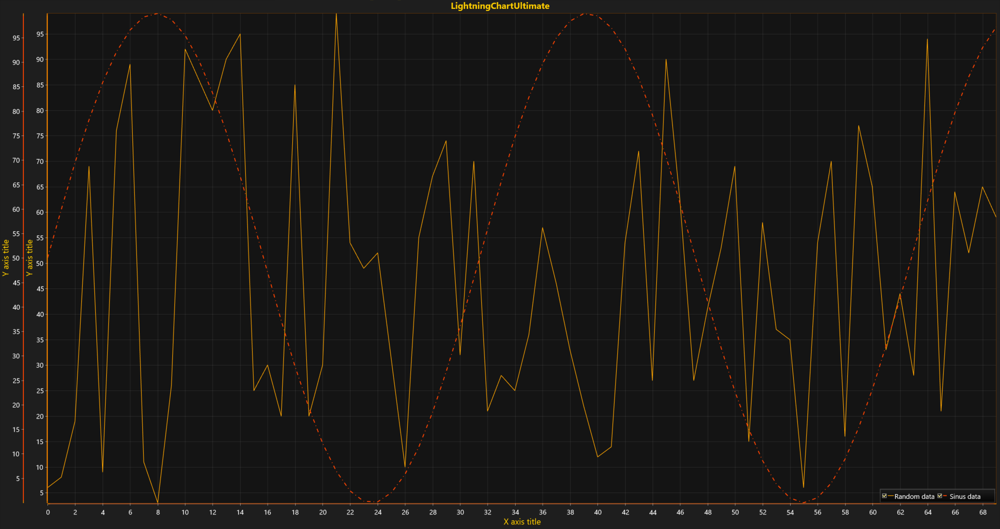

# Multiple Axes

The previous explained about best practices of data visualization in terms of Data Analysis. Another way to show a variety of series in one chart without overlaps and mess is combining multiple axes in Layered / Stacked / Segmented layout for better view organization.



This tutorial will show how to create additional Y-axes and assign line series to different axes. Modify the code from the previous article. Add a new Y-axis before a block with line series initialization ***series2*** according to the following steps below.

##### 1. Create new axis with information about 2D View.

```csharp
// New y-axis instance assigned to XY layout.
var axisY = new AxisY(chart.ViewXY);
```
##### 2. Configure and set options.

```csharp
// Configure (e.g. Color). 
axisY.AxisColor = Color.FromArgb(255, 255, 255, 0);
```

##### 3. Make created axis a part of a chart.

```csharp
// Add the y-axis into list of YAxes.
chart.ViewXY.YAxes.Add(axisY);
```

Having multiple X or Y axes, a user can assign each data series to an individual axis during either series instance declaration or after that by changing special properties.

* Declare a new instance of a series and send references to the axes objects as arguments to the constructor.

  ```csharp
  var series2 = new PointLineSeries (
      chart.ViewXY,
      chart.ViewXY.XAxes[0],
      axisY
  );
  ```

  or

  ```csharp
  var series2 = new PointLineSeries (
      chart.ViewXY,
      chart.ViewXY.XAxes[0],
      chart.ViewXY.YAxes[1]
  );
  ```

* Declare a new instance of a series with an empty \(default\) constructor and assign indexes to desired axes manually at any time during your application execution.

  ```csharp
  var series2 = new PointLineSeries();
  series2.AssignXAxisIndex = 0; // Assign to the 1st x-axis.
  series2.AssignYAxisIndex = 1; // Assign to the 2nd y-axis.
  ```

<!-- Layout and axes configuration features such as placement, alignment, and layout location \(Layered - default, Stacked,  Segmented\) will be explained in further tutorials. -->

