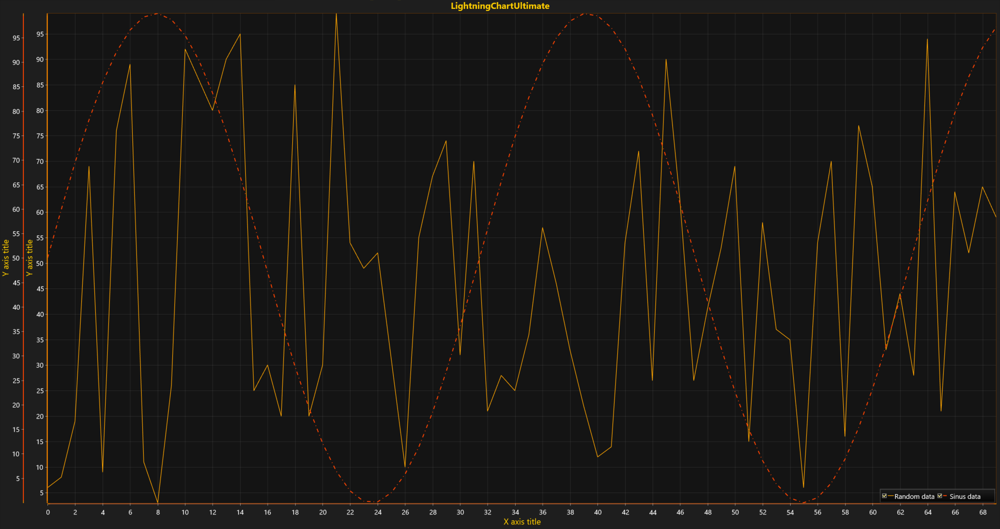

# Multiple Axes

The previous explained about best practices of data visualization in terms of Data Analysis. Another way to show a variety of series in one chart without overlaps and mess is combining multiple axes in Layered / Stacked / Segmented layout for better view organization.



This tutorial will show how to create additional Y-axes and assign line series to different axes. Modify the code from the previous tutorial [Multiple Series](https://www.arction.com/tutorials/#/lcu_tutorial_multipleSeries_02). Add a new Y-axis before a block with line series initialization ***series2*** according to the following steps below.

##### 1. Define a new color to be used for new Y-axis and series coloring and create a new Y-axis.

```csharp
// Define color which will be used for new Y-axis and series coloring.
Color color = Color.FromArgb(255, 255, 67, 0);

// Create a new Y-axis.
var newAxisY = new AxisY(chart.ViewXY);
newAxisY.AxisColor = color;
newAxisY.MajorGrid.Visible = false;
```

##### 2. Add the new Y-axis into list of Y-axes.

```csharp
// 2. Add the new Y-axis into list of Y-axes.
chart.ViewXY.YAxes.Add(newAxisY);
```

##### 3. Create a new PointLineSeries for the new Y-axis and add it to the list of PointLineSeries.

```csharp
// 3. Create another PointLineSeries and set new color and line-pattern for it.
var series2 = new PointLineSeries(chart.ViewXY, axisX, newAxisY);
series2.LineStyle.Color = color;
series2.LineStyle.Pattern = LinePattern.DashDot;
series2.Title.Text = "Sinus data";
series2.Points = data;
```

##### 4. Add series to chart.

```csharp
// 4. Add series to chart.
chart.ViewXY.PointLineSeries.Add(series2);
```

By having multiple X- or Y-axes, a user can assign each data series to an individual axis during either series instance declaration or after that by changing special properties.

* Declare a new instance of a series and send references to the axes objects as arguments to the constructor.

  ```csharp
  var series2 = new PointLineSeries (chart.ViewXY, chart.ViewXY.XAxes[0], newAxisY);
  ```

  or

  ```csharp
  var series2 = new PointLineSeries (chart.ViewXY, chart.ViewXY.XAxes[0], chart.ViewXY.YAxes[1]);
  ```

* Declare a new instance of a series with an empty \(default\) constructor and assign indexes to desired axes manually at any time during your application execution.

  ```csharp
  var series2 = new PointLineSeries();
  series2.AssignXAxisIndex = 0; // Assign to the 1st X-axis.
  series2.AssignYAxisIndex = 1; // Assign to the 2nd Y-axis.
  ```

<!-- Layout and axes configuration features such as placement, alignment, and layout location \(Layered - default, Stacked,  Segmented\) will be explained in further tutorials. -->

